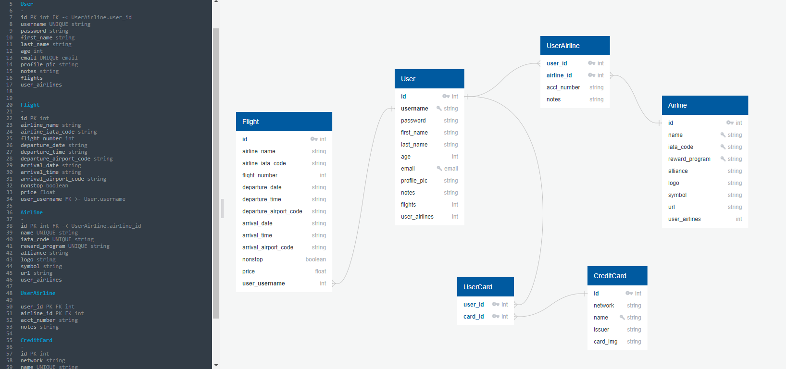

# **FlightClub**

Full-stack application for Springboard's software engineering curriculum.

---
### **API used:**
1. [Amadeus for Developers](https://developers.amadeus.com/self-service/category/air/api-doc/flight-offers-search)
2. [Priceline API](https://priceline-com-provider.p.rapidapi.com/v2/flight/departures)

---
### **Description:** 
The Flight Club initiative was started shortly after my years working as an Int'l travel manager and from the knowledge and expertise I acquired.

This app will allow a user to create a personalized account, search worldwide flight paths, save individual flights of interest, add airline reward programs to their profile, and receive feedback from Flight Club on which airline programs they have that are matches to each of their saved flights. This essentially discloses all the available airlines that would sell a specific flight of interest under their own brand name -- with their own airline miles -- thus exposing many other outlets of purchase for a single flight with potential savings.

The 3 standing pillars that make Flight Club beneficial:
1. Every major airline has a free and easy-to-use rewards program.
2. Most major credit cards acrue points from purchases that can be transferred to a dozen or more airline reward programs.
3. Major airlines are a part of a larger airline alliance that exercise "codeshare" agreements -- flights that are purchaseable under an allies brand with that airline's reward points.
Flight Club marries these principles together in an intuitive and convenient program that helps users manage flights

---
### **Features:** 
- One
- Two
- Three

---
### **User Flow:**
A user will be required to create a free account before having access to a personalized profile, ability to search/save flights, and add airline frequent flier programs.

Once registered and logged in, a user can navigate to their profile page to add all of their current airline reward programs. i.e. Delta Skymiles, Air France Flying Blue, British Airways Executive Club, etc.

A registered user has access to Search Flights, which allows a user to search and display nonstop flights from any worldwide flight paths using both airport's 3-character IATA code (JFK-New York, ATL-Atlanta, LHR-London, etc.).

If a flight of interest is found, the user can choose to save this flight to their profile. A user can save any number of flights. After a saved flight is selected from a user's profile, Flight Club will filter the saved flight's airline alliance partners against the user's current saved airline rewards programs. A list of compatible airline partners is rendered for the user, which essentially tells the user that their selected flight is potentially available for purchase with that list of alliance airlines' reward programs, of which the user already has an account. 

Example: A user is interested in the nonstop Swiss Airlines flight from New York to Zurich on some given date. Selecting this route after a user's search will result in Flight Club filtering out the other airlines that are currently codeshare partners with Swiss airlines that could sell that particular ticket. i.e. United Airlines' MileagePlus program, and Air Canada's AeroPlan program. The user's account will be scanned to see which partner airline frequent flyer programs they are already a member with and suggest those programs, as well as other alliance members that the user currently does not have an account with.

---
### **Install: Heroku, Render, Railway**
Installation instructions:

---
### **Technologies:** 
Flight Club was mainly created using Flask. The local PostgreSQL DB was seeded with hard coded airline data.
Other technologies used:
- SQL/PostgreSQL
- SQLAlchemy
- Python/Flask
- WTForms
- bcrypt
- jQuery
- HTML Jinja Templating
- Bootstrap5/CSS

---
### **Database Schema:**

